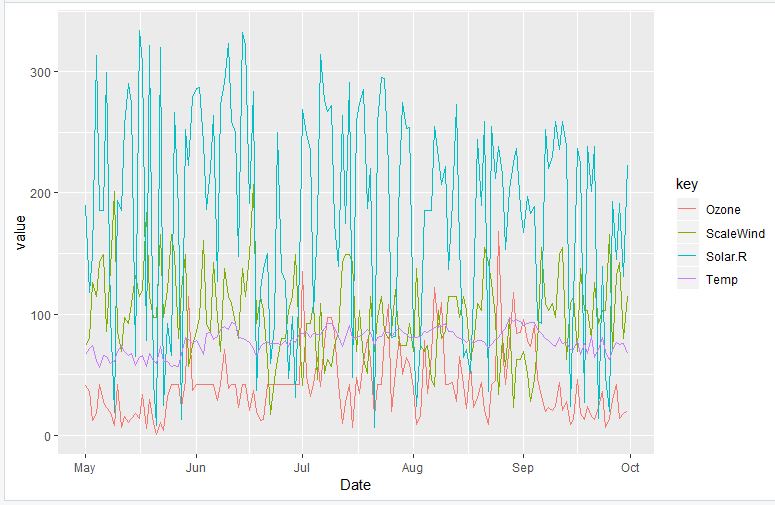
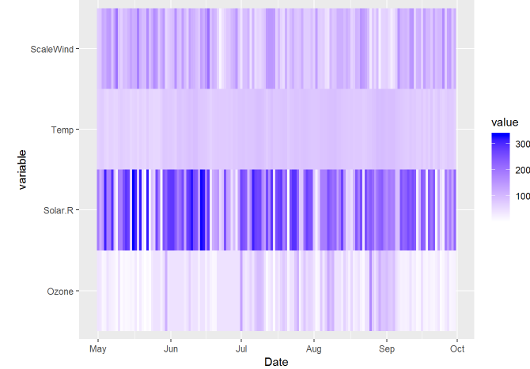

---

# Instructions

Use the built-in `airquality` R dataset to visualize the air quality in 1973.
Explore the patterns in the data by creating histograms, boxplots, line graphs, 
heatmaps, and scatterplots. 

Load the libraries `ggplot2` and `reshape2` in the setup chunk below.

---

```{r setup, message = FALSE}
library(ggplot2)
library(reshape2)
library(tidyr)

```

# Step 1 - Load the Data

We will use the `airquality` dataset that you have as part of your R installation. 
Read the `airquality` data using the `data.frame()` function and save it as `air`.

```{r, "Step 1"}
air <- data.frame(airquality)

```

---

# Step 2 - Clean the Data

After you load the data, there will be some NA values in the data. 
You need to figure out what to do about those nasty NAs. Google is your friend. 
Use Google actively to find a way to get rid of NAs using R. 

**HINT:** Find columns that include NA values first 
(use `colSums()` function, then replace NAs with the mean value of these columns).

Optional: If you want to implement a better approaches to deal with missing data, 
"multiple imputation" would be where you should go.   
You can check sources like:

 - https://gking.harvard.edu/amelia
 - http://cran.revolutionanalytics.com/web/packages/mitools/index.html

```{r, "Step 2"}

# Create a new data frame with the same structure as air
new_air <- air

# Replace NA values and preserve integer data type for columns except "Wind"
new_air[, names(air) != "Wind"] <- lapply(new_air[, names(air) != "Wind"], function(x) {
  ifelse(is.na(x), as.integer(round(mean(x, na.rm = TRUE))), as.integer(x))
})

# Reassign the original "Wind" column to the new data frame
new_air$Wind <- air$Wind


```

---


# Step 3 - Understand the data distribution

Create the following visualizations:

 - Histograms for each of the variables
 - Boxplot for `Ozone`, and boxplots for different `wind` values 
 (round `wind` to get a good number of “buckets”) 
 
**HINT:** you can create one graph with `Ozone` as X-axis and `Wind` as Y-axis. 
Also, you can create two graphs (one with `Ozone` values on the Y-axis, and 
another one with Y-axis value is rounded value of `Wind`). In this case, you need 
to create a fake grouping variable `(x = factor(0))`.

```{r, "Step 3"}
Create_His <- function(x_var) {
  ggplot(new_air, aes(x = .data[[x_var]]) ) + 
    geom_histogram(binwidth=5, color="black", fill="white")
}

Create_His("Ozone")
Create_His("Solar.R")
Create_His("Wind")
Create_His("Temp")
Create_His("Month")
Create_His("Day")

ggplot(new_air,aes(as.factor(Ozone),Month)) +
  geom_boxplot(fill = 'green')

ggplot(new_air,aes(as.factor(Wind),Ozone)) +
  geom_boxplot(fill = 'blue')

```

---

# Step 4 - Explore how the data changes over time

First, create the appropriate dates (this data was from 1973). 
Then create line charts for `Ozone`, `Temp`, `Wind` and `Solar.R` 
(one line chart for each, and then one chart with 4 lines, each variable having a different color). 

**HINT:** 

1. Combine (use `paste()` function) 1973 with the `Month` and `Day` columns,
using "/" in between
2. Use `as.Date()` function to transform the value to "Date" format and create 
a `Date` column to record this value. Use `?as.Date` to find example use of this function.

Note that for the chart with 4 lines, you need to think about how to effectively use the y-axis. 

**HINT:** 
You need to "melt" the columns so that it becomes "long" format. You can either 
use the `melt()` function or use the `gather()` from the "tidyr" package for the process. 
Also, compared to other values, the `Wind` values are too small, 
so they are close to the x-axis. You need to multiply `Wind` by 10 to address this problem. 

The correct result should look like this:


```{r, "Step 4"}
new_air$date <- as.Date(paste("1973", new_air$Month,new_air$Day, sep="-"))

graph <- ggplot(new_air, aes(x= date, y = Ozone)) + 
  geom_line(color = "blue")
graph2 <- geom_line(aes(x = date, y = Temp), color = "orange")
graph3 <- geom_line(aes(x = date, y = Solar.R), color = "red")
graph4 <- geom_line(aes(x = date, y = Wind), color = "magenta")

graph <- graph + graph2 + graph3 + graph4 

graph

```
 

# Step 5: Look at all the data via a heatmap

Create a heatmap, with each day (using dates) along the x-axis and 
`Ozone`, `Temp`, `Wind` and `Solar.r` along the y-axis.

Note that you need to figure out how to show the relative change equally across 
all the variables. 

**HINTS:** 
- You may find this post helpful:
- https://learnr.wordpress.com/2010/01/26/ggplot2-quick-heatmap-plotting/
- Melt the original table to make a long format before visualization using `geom_tile()`

Remember, your programming skills will improve as much as you struggle and 
put effort in them.

The correct result should look like this:


```{r, "Step 5"}

Month_Day <- unite(new_air,Month_Day,Month,Day, sep = "/")
Month_DayMelt <- melt(Month_Day, id=c("Month_Day"))
ggplot(Month_DayMelt, aes(x = Month_Day, y = variable, fill = value)) + geom_tile()


```

# Step 6: Look at all the data via a scatter chart

Create a scatter chart, with:
 - the x-axis representing the `Wind`
 - the y-axis representing the `Temp`
 - the size of each dot representing the `Ozone`
 - the color representing `Solar.R`

```{r, "Step 6"}

ggplot(new_air, aes(x=Wind, y=Temp, size=Ozone, color=Solar.R)) +
  geom_point()


```

# Step 7: Final analysis
### You MUST answer to these questions in your compiled file.

Do you see any patterns after exploring the data?

> [After exploring the data, one detail made very apparent was that Temperature and Ozone seem to fluctuate together. As the amount of Ozone recorded increases, Temperature is higher, and vice versa.]

What was the most useful visualization?

> [Perhaps the most useful graph is the one showcasing the four line graphs together, which allowed for being able to more easily compare intensities of recorded data in specififc periods of time.]